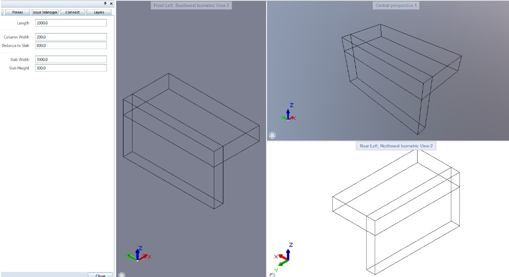

Usage
=====

.. _installation:

Installation
------------

To use Pythonparts, first install it using pip:

.. code-block:: console

   (.venv) $ pip install pythonparts

Basic setup & usage
-------------------

Users will mostly import ``pythonparts`` package.
Let's build a simple joint that consists of a vertical 
Wall part and a horizontal Slab part:

In order to create the following Python Part, we need to define ``Joint.pyp`` for Control menu 
and ``joint.py`` for logics.
``Joint.pyp`` will look this way::

    <?xml version="1.0" encoding="utf-8"?>
    <Element>
        

        <Page>
            <Name>Page1</Name>
            <Text>Joint</Text>

            <Parameter>
                <Name>Length</Name>
                <Text>Length</Text>
                <Value>2000.</Value>
                <ValueType>Length</ValueType>
            </Parameter>

            <Parameter>
                <Name>Separator1</Name>
                <ValueType>Separator</ValueType>
            </Parameter>

            <Parameter>
                <Name>ColumnWidth</Name>
                <Text>Column Width</Text>
                <Value>200.</Value>
                <ValueType>Length</ValueType>
            </Parameter>
            
            <Parameter>
                <Name>SlabDist</Name>
                <Text>Distance to Slab</Text>
                <Value>800.</Value>
                <ValueType>Length</ValueType>
            </Parameter>

            <Parameter>
                <Name>Separator2</Name>
                <ValueType>Separator</ValueType>
            </Parameter>

            <Parameter>
                <Name>SlabWidth</Name>
                <Text>Slab Width</Text>
                <Value>1000.</Value>
                <ValueType>Length</ValueType>
            </Parameter>

            <Parameter>
                <Name>SlabHeight</Name>
                <Text>Slab Height</Text>
                <Value>300.</Value>
                <ValueType>Length</ValueType>
            </Parameter>

        </Page>
    </Element>

Let's finally use our ``pythonparts`` package in ``joint.py``:

.. code-block:: python

    import pythonparts as pp

    def check_allplan_version(build_ele, version):
        return True

    def create_element(build_ele, doc):
        # Create a Scene object. Works like canvas
        scene   = pp.create_scene(build_ele)
        # Create the first Cuboid object that represents column
        column  = pp.create_cuboid(build_ele.ColumnWidth.value,
                                    build_ele.Length.value, 
                                    build_ele.SlabDist.value + 
                                    build_ele.SlabHeight.value)
        # Create the second Cuboid object, slab
        slab    = pp.create_cuboid(build_ele.SlabWidth.value,
                                build_ele.Length.value, 
                                build_ele.SlabHeight.value)
        # By default 'place' method would place slab in the 
        # left bottom front side of column.
        column.place(slab, top=0)
        scene.place(column)

        return scene.pythonpart

Flexible positioning
--------------------

With ``pythonparts`` module you can easily control 
positioning of different elements that will anchor 
to the parent element and always stick to it whenever
parent element moves

Let's create ``slab``:

    >>> import pythonparts as pp
    >>> slab  = pp.create_cuboid(200, 1000, 200)
    >>> slab.global_.start_point
    Point3D(0, 0, 0)
    >>> slab.global_.end_point
    Point3D(200, 1000, 200)

Let's then anchor it to another cuboid with some idents:

    >>> column  = pp.create_cuboid(1000, 1000, 1000)
    >>> column.place(slab, right=300, bottom=120, back=250)
    >>> slab.global_.start_point    # New global coords
    Point3D(500, -250, 120)
    >>> slab.global_.end_point
    Point3D(700, 750, 320)

As you can see, the location with idents changed
basic global coords for ourr ``slab``. 
Let's try to place out column to scene with idents 
and observe ``slab``'s new global coordinates:

    >>> scene  = pp.create_scene('build_ele')
    >>> scene.place(column, left=150, front=250)
    >>> slab.global_.start_point    # New global coords
    Point3D(650, 0, 120)
    >>> slab.global_.end_point
    Point3D(850, 1000, 320)

After placing ``column`` on left 150 and front 250 due to start
of the Scene, we can see that ``slab``'s global coords changed
once again. Because ``slab`` is anchored to ``column``, if we
move ``column``, ``slab`` will move, too.
